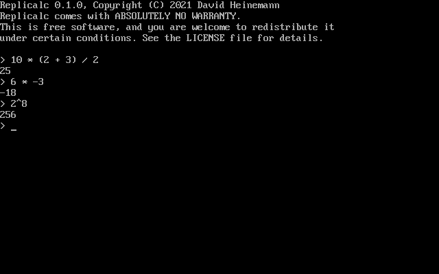

# Replicalc

Replicalc is a simple keyboard-driven calculator for Linux, Windows, and MS-DOS.
Expressions are evaluated inside a REPL, similar to the classic TI-83
calculator.



## Status

This is a hobby project to learn the C programming language. The code is bad
and will contain bugs; it can be considered an early alpha. Run at your own
risk.

## Features

**Operators**

* Addition (`+`), Subtraction (`-`), Multiplication (`*`), Division (`/`)
* Exponents (`^`)
* Parenthesis (`(`, `)`)

Additional operators are forthcoming.

**History**

Use the Up and Down keys to switch between expressions previously entered within the same session.

## Windows Releases

Pre-compiled Windows releases can be downloaded [here](https://dheinemann.com/files/replicalc/).

## Compiling

Before proceeding, initialize all Git submodules if you haven't already done so:

```
git submodule init
git submodule update
```

### Linux

1. Install the ncurses development library. For example (Fedora): `sudo dnf install ncurses-devel`
2. Navigate to the `linux` directory.
2. Run `make`.

### Windows 95, 98, ME, 2000, XP, 7, 8, 10

1. Install the [Open Watcom compiler for Windows](http://openwatcom.org).
2. Navigate to the `win32` directory.
2. Run `wmake`.

### MS-DOS, Windows 1, 2, 3

1. Install the [Open Watcom compiler for DOS](http://openwatcom.org).
2. Navigate to the `dos` directory.
2. Run `wmake`.

## License

Replicalc is published under the GNU General Public License, version 2. See the
LICENSE file for more information.
