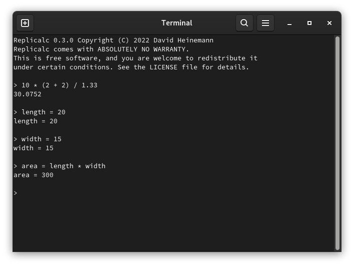

# Replicalc

Replicalc is a simple keyboard-driven calculator for Linux, Windows, and MacOS.
Expressions are evaluated inside a REPL, similar to the classic TI-83
calculator.

## Status

This is a hobby project. It may contain bugs and can be considered an early
alpha. Run at your own risk.

## Features

**Operators**

* Addition (`+`), Subtraction (`-`), Multiplication (`*`), Division (`/`), Modulo (`%`)
* Exponents (`^`)
* Parenthesis (`(`, `)`)

Additional operators are forthcoming.

## Windows Releases

Pre-compiled Windows releases can be downloaded [here](https://dheinemann.com/projects/replicalc).

## Compiling

To compile Replicalc, you will need [Go](https://go.dev) 1.16 (or newer).

To compile:

1. Open the terminal and navigate to the **src** directory.
2. Run `go build`.

## License

Replicalc is published under the GNU General Public License, version 2. See the
LICENSE file for more information.
